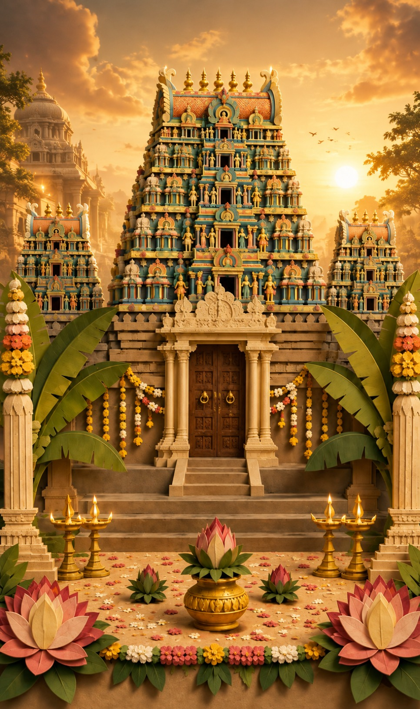
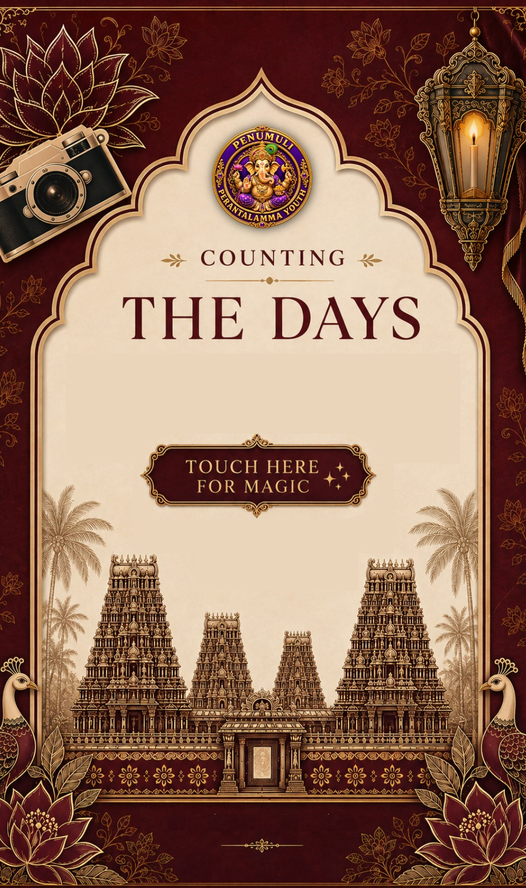
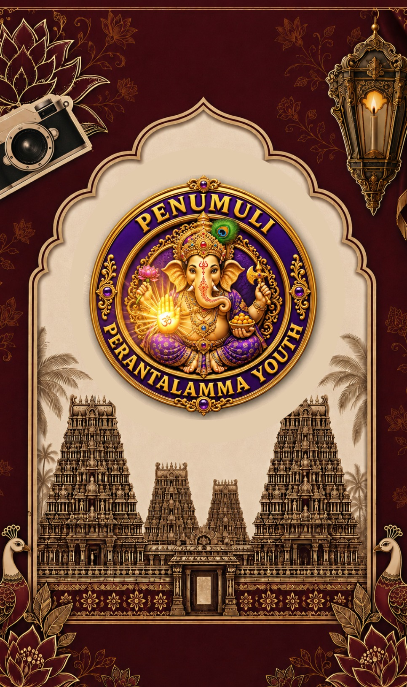
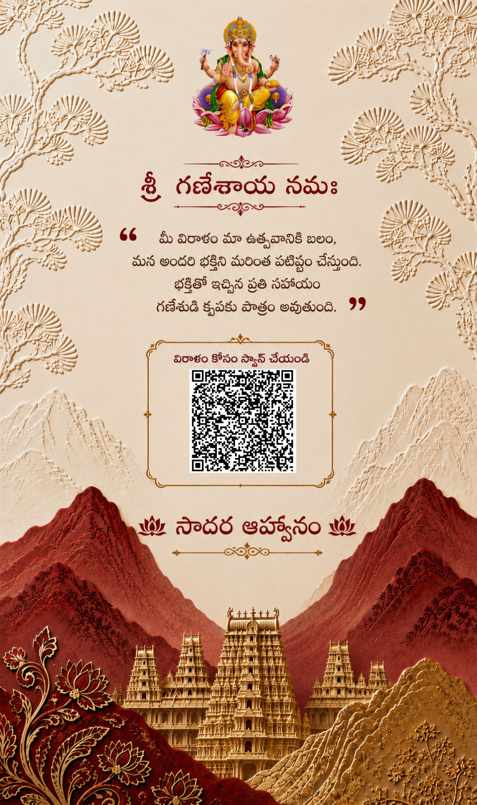

# 🪔 Vinayaka Chaturthi Interactive Invitation

[](https://vinayaka-chaturthi-inviation.vercel.app)
[](https://github.com/Phanicool1117/Vinayaka-Chaturthi-Inviation)

An immersive, mobile-first interactive digital invitation for **Vinayaka Chaturthi**, presented by **Penumuli Perantalamma Youth**.

---

## 🌟 Live Preview

👉 **[Experience the Live Invitation](https://vinayaka-chaturthi-inviation.vercel.app)**

---

## 📸 Visual Showcase

<div align="center">

| Temple Exterior Entrance | Interactive 3D Doors |
| :---: | :---: |
|  |  |

| English & Telugu Invitation Booklet | Live Countdown & Bell Chime |
| :---: | :---: |
|  |  |

| Divine Blessing Reveal | Devotional Giving & Details |
| :---: | :---: |
|  |  |

</div>

---

## ✨ Features

- 🏛️ **Cinematic Temple Approach:** Atmospheric parallax entry as you approach the temple sanctum.
- 🚪 **Interactive 3D Temple Doors:** Tap-to-open door animation powered by 3D CSS transforms and GSAP. Scroll is held until the sanctum doors are unlocked.
- 📖 **Flip Invitation Booklet:** Dual-language invitation cards in English and Telugu with 3D page-turn dynamics.
- ⏳ **Real-Time Live Countdown:** Dynamic timer counting down days, hours, minutes, and seconds to the auspicious celebration.
- 🔔 **Interactive Temple Bell:** Tap the sacred bell hotspot to trigger custom devotional chimes and transitions.
- 🎶 **Atmospheric Devotional BGM:** Ambient background music with easy user toggle controls.
- 📱 **Mobile-First & Desktop Adaptive:** Designed natively for mobile screens, featuring an integrated phone mockup view on desktop browsers.
- ⚡ **Performance & Analytics:** Built-in Vercel Web Analytics and Speed Insights for real-time monitoring.

---

## 🛠️ Tech Stack

- **Markup & Styling:** Semantic HTML5, Modern CSS3 (3D Transforms, CSS Grid/Flexbox, Custom Properties)
- **Animations & Smooth Scrolling:** [GSAP (GreenSock)](https://greensock.com/gsap/) with [ScrollTrigger](https://greensock.com/scrolltrigger/), [Lenis](https://github.com/darkroomengineering/lenis) Smooth Scroll
- **Typography:** Cormorant Garamond & Outfit (Google Fonts)
- **Audio:** Web Audio API with custom SFX and devotional background score
- **Deployment & Insights:** [Vercel](https://vercel.com) with `@vercel/analytics` and `@vercel/speed-insights`

---

## 📂 Project Structure

```
├── assets/                  # High-resolution visual assets and frames
│   ├── frame-01-temple-exterior.jpeg
│   ├── frame-02-temple-entrance.jpeg
│   ├── frame-03-doors-closed.jpeg
│   ├── ...
│   └── frame-14-donation-qr.jpeg
├── audio/                   # Background score and sound effects
│   ├── devotional-music.mp3
│   └── temple-bell.mp3
├── css/                     # Stylesheet and animations
│   └── experience.css
├── js/                      # Core interactive logic
│   ├── audio.js             # Audio controller
│   ├── countdown.js         # Real-time countdown timer
│   └── experience.js        # GSAP timelines, Lenis scroll, 3D interactions
├── vendor/                  # GSAP, ScrollTrigger, Lenis libraries
├── index.html               # Main application entry
├── package.json             # Project dependencies and metadata
└── README.md                # Project documentation
```

---

## 🚀 Getting Started Locally

### Prerequisites
- Node.js (v18 or higher recommended)

### Installation & Run

1. **Clone the repository:**
   ```bash
   git clone https://github.com/Phanicool1117/Vinayaka-Chaturthi-Inviation.git
   cd Vinayaka-Chaturthi-Inviation
   ```

2. **Install dependencies:**
   ```bash
   npm install
   ```

3. **Start local preview:**
   ```bash
   npx serve .
   ```
   Open `http://localhost:3000` (or the port indicated in terminal) in your browser.

---

## 🌐 Deployment

This project is deployed on **Vercel**. Any updates pushed to the `main` branch automatically deploy to production:

```bash
git add .
git commit -m "Your commit message"
git push origin main
```

---

## 🙏 Credits & Acknowledgments

- Organized & Celebrated by **Penumuli Perantalamma Youth**
- Devotional Music & Visual Assets crafted for Vinayaka Chaturthi celebrations
